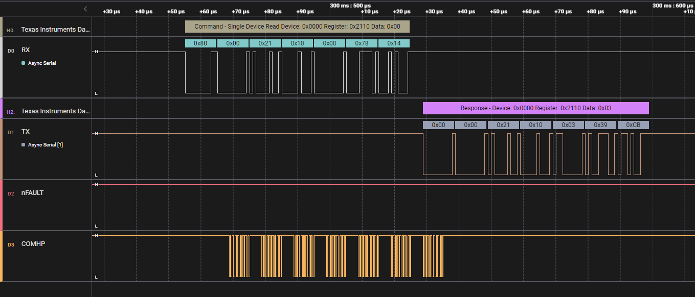

# Texas Instruments Daisy Chain Protocol

Extension allows decoding of Texas Instrument daisy chain communication protocol used for interfacing battery management related chips like BQ7961x, BQ7971x over serial bus isolated using BQ79600 bridge interface.  

As analyzer is state based, **Frame Timeout** parameter must be provided in order to determine, when to discard corrupt frame and reset state machine processing incoming data. Unit of parameter is `seconds`, so setting the value to for example **0.01** achieves timeout of 10 milliseconds.

Detailed protocol description can be found there: 

- Chapter **7.3.2** of [BQ79600 datasheet](https://www.ti.com/lit/ds/symlink/bq79600-q1.pdf?ts=1685607799579&ref_url=https%253A%252F%252Fwww.ti.com%252Fproduct%252FBQ79600-Q1)
- Chapter **9.3.6** of [BQ7961x datasheet](https://www.ti.com/lit/ds/symlink/bq79616-q1.pdf?ts=1685620124928&ref_url=https%253A%252F%252Fwww.ti.com%252Fproduct%252FBQ79616-Q1)  

#

## Version 0.2

- full protocol support for UART based communication
- error reporting and discarding of timed out transmissions

#

  